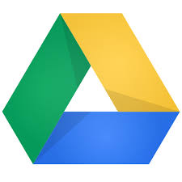
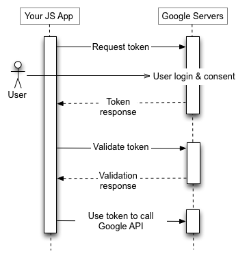
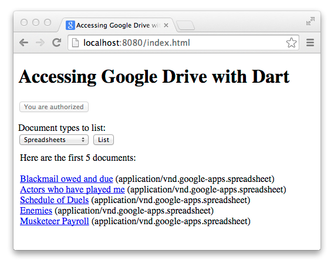

# Google API Client Libraries with Dart

Google provides a large set of APIs that your applications can use
to interact with Google products such as Google Drive, Gmail,
Cloud Datastore, and Cloud Storage.
These APIs are accessible via REST-like interfaces.
The Dart team provides the googleapis and
googleapis_beta packages,
which provide generated Dart libraries for these APIs.
Using the APIs, which are available for
both web apps and cloud apps,
is more convenient and less error-prone
than using the raw REST protocol.

To use any of these APIs, you need a Cloud Project.
In addition, based on the API being used, you need either an API
key or a Client ID.
And finally, depending on what kind of application is being
used, you might need a Service Account.
All these items are available through
Google Developers Console when you create a project.
Below are a few scenarios:

* APIs require a Client ID specific to the kind of application
when it accesses data that is owned by a user
on behalf of that user (with consent):
for example a browser application or a console application.

* A server application can access data owned by the application
itself by using a Service Account.
Example: a server application accessing data in Datastore
or Google Cloud Storage.

* APIs that can be used to get public data require only
an API key (for quota and billing purposes).

To set up authentication and authorization for your app,
you need to create a project, create the authentication credentials,
and activate the API you want to use, all of which you do at
<a href="https://console.developers.google.com">Google Developers Console</a>.

Support for Google APIs is in two packages—<a href="https://pub.dartlang.org/packages/googleapis">googleapis</a> and
<a href="https://pub.dartlang.org/packages/googleapis_beta">googleapis_beta</a>.
The googleapis package contains the APIs for all
the APIs that are available in a stable version.
The googleapis_beta
package contains the APIs that are currently in
beta and possibly only available through a Limited Preview program.

A third package,
<a href="https://pub.dartlang.org/packages/googleapis_auth">googleapis_auth</a>,
provides a way to obtain OAuth 2.0 credentials and an authenticated HTTP client
required to use these APIs.

The rest of this document describes the following:

* [Some of the APIs you can use](#some-of-the-apis-you-can-use)
* [OAuth 2.0](#oauth-20)
* [What do you need?](#what-do-you-need)
* [A web application example](#a-web-application-example)
* [Using a service account for a cloud API](#using-a-service-account-for-a-cloud-api)
* [Contribute](#contribute)
* [Resource links](#resource-links)
* [What next?](#what-next)

## Some of the APIs you can use

Here are just a few of the APIs your Dart programs can use.

<dl>
<dt> Google Drive</dt>
<dd>
Google Drive is a Cloud Storage service that allows you to store your documents,
photos, videos, and more online.
The Google Drive client library lets you access Google Drive services,
such as reading and writing files.
</dd>

<dt> Gmail</dt>

<dd>
The Gmail API gives you flexible, RESTful access to the user's inbox,
with a natural interface to threads, messages, labels, drafts, and history.
</dd>

<dt> Cloud Datastore</dt>

<dd>
Using Cloud Datastore client libraries you have access
to a fully managed, schemaless database
for storing non-relational data.
Cloud Datastore provides high availability of reads and writes,
strong consistency for reads and ancestor queries,
and eventual consistency for all other queries.
</dd>

<dt> Google Cloud Storage</dt>
<dd>
Google Cloud Storage provides a fast, scalable, highly available object store that scales
as your needs grow.
You can access your data with an HTTP API, a web-based interface,
or a commmand-line tool.
</dd>

</dl>

You can see the full list of APIs at
<a href="https://pub.dartlang.org/packages/googleapis">googleapis</a> and
<a href="https://pub.dartlang.org/packages/googleapis_beta">googleapis_beta</a>.

## OAuth 2.0

Applications sometimes require OAuth 2.0 for authentication and authorization.
Whether an application needs OAuth 2.0
depends on the API being used and the kind of data being accessed.
For example, an application needs OAuth 2.0 if it needs user consent.
An application sometimes needs OAuth 2.0 depending on the
following properties:

* Using public API (no credentials needed)
* Using API that can be accessed using an API Key (no concrete user)
* Using API that provides access to user data (user consent)
* Using API that provides access to application data (service account)

The OAuth 2.0 protocol provides different _flows_ for different types
of applications, including web server, installed, and client-side applications.
For example, the following diagram illustrates the flow of communication
for client-side applications:

<a name="diagram"></a>



<a href="https://developers.google.com/accounts/docs/OAuth2">
  Using OAuth 2.0 to Access Google APIs
</a>
gives a detailed overview of the OAuth 2.0 authorization
scenarios that Google supports.

## What do you need?

To write a program that interacts with a Google product,
you need several tools and packages.

<dl>

<dt><strong>A Google account</strong></dt>
<dd>If you don't already have a Google account, you can create one
at <a href="https://accounts.google.com/SignUp">Create your Google Account</a>.
</dd>

<dt><strong>A project in Google Developers Console</strong></dt>
<dd>
Every application that uses the client libraries
needs a project in Google Developers Console.
A project is a collection of settings, credentials, and metadata
about the application.
Google Developers Console is where you manage aspects of your project,
such as authenticating and authorizing you application, activating APIs,
and managing team and billing information associated with your project.
You must have a project to get OAuth2 service accounts and client IDs.
</dd>

<dt><strong>The googleapis_auth package</strong></dt>
<dd>
Access to Google APIs uses the HTTP protocol.
The googleapis_auth package
provides different means for creating an HTTP client that can handle the
authorization. This HTTP client is then passed to the API objects and takes care
of augmenting the communication with the required authorization information.
The Dart googleapis_auth client library is available at
<a href="https://pub.dartlang.org/packages/googleapis_auth">pub.dartlang.org/packages/googleapis_auth</a>.
There you can find a detailed README file with code examples
and explanatory text.
</dd>

<dt><strong>The googleapis or googleapis_beta package</strong></dt>
<dd> These packages are publicly available at
<a href="https://pub.dartlang.org/packages/googleapis">pub.dartlang.org/packages/googleapis</a> and
<a href="https://pub.dartlang.org/packages/googleapis_beta">pub.dartlang.org/packages/googleapis_beta</a>.
Later, you'll see an example of how to use them in your Dart program.
</dd>

<dt><strong>Dart</strong></dt>
<dd> Get Dart from <a href="https://www.dartlang.org/downloads/">the download page</a>.
</dd>

</dl>

## A web application example

Let's look at a web application example that
uses the googleapis Google Drive API
to retrieve documents from a user's Google Drive.
The following screenshot shows the app
after it has retrieved a list of spreadsheets
from a user's Google Drive and displayed them on the page.



You can find the source code for this example,
<a href="https://github.com/dart-lang/googleapis_examples/tree/master/drive_search_web">drive_search_web</a>,
and others, at
<a href="https://github.com/dart-lang/googleapis_examples">googleapis_examples</a>
on GitHub.

The section [Example explained](#example-explained)
describes the code in the drive_search_web example related to googleapis
and googleapis_auth.
But first let's look at how to run the example.

### Running the example

To run this example, you need to create a project, activate an API,
and create a Client ID in Google Developers Console.
This section provides instructions about how to do these for this
particular example.
For complete information and detailed explanations, refer to
<a href="https://developers.google.com/console/help/new/">Google Developers Console Help</a>.

#### Create project

* Go to <a href="https://console.developers.google.com/">Google Developers Console</a>.

* Click the <strong>Create Project</strong> button.

* Provide a name for your project.

* Click the <strong>Create</strong> button.

#### Activate the Drive API

* On left of the project page, click <strong>APIs & auth</strong>,
click <strong>APIs</strong>.

* Turn on the authentication for <strong>Drive API</strong>.
It might take a couple of minutes to propagate.

#### Create a client ID

* On the left of the project page, under <strong>APIs &amp; Auth</strong>,
then click <strong>Credentials</strong>.

* Click <strong>Create new Client ID</strong>.

* In the popup window,
click <strong>Web application</strong>, then fill in the form.
Use http://localhost:8080 for
<strong>Authorized JavaScript origins</strong>.
Because this example is a client-side-only application,
don't put a value in <strong>Authorized redirect URIs</strong>.
This example runs on the local computer and uses port 8080.
Ensure nothing else is using port 8080.
If you later run this example from a different origin,
you'll need a new Client ID.

* Click <strong>Create Client ID</strong>.

#### Run the example

* In the index.dart file,
change <strong><please fill in></strong> to the client ID generated
in the previous step.
The client ID ends in apps.googeusercontent.com.

* In the top directory of the application, run `pub serve`.

* Visit http://localhost:8080 in a browser window.
  After a little while, you'll see a built version of the app.

* Click <strong>Authorize</strong>
and accept the authorization on the page that appears.

* Select a document type from the drop-down menu and click <strong>List</strong>.
The program displays the list of files from the Google Drive of the user who is currently
logged in. (Later the user can revoke access if desired.) Refer to
<a href="http://security.google.com">Security - Account Settings</a> for details.

This example, drive_search_web,
uses the Google Drive API and the OAuth 2.0 API to
access the user's files on Google Drive.
Let's look at the relevant parts of the example.


* To use the googleapi packages,
  you need to declare dependencies
  in the pubspec.yaml file.

```yaml
dependencies:
  googleapis_auth: '>=0.1.0 < 0.2.0'
  googleapis: '>=0.1.1 < 0.2.0'
```


* In addition to declaring dependencies, you need to import
  the libraries from the packages into your Dart file.
  This example has only one Dart file, index.dart,
  which imports the libraries like this:

```dart
import 'package:googleapis_auth/auth_browser.dart' as auth;
import 'package:googleapis/drive/v2.dart' as drive;
```

* At the top level, the program gets an identifier for the client
  with its ID created in Google Developers Console.
  In addition, the code defines the scope of the APIs it intends to use.
  The scope controls the set of APIs or parts of APIs that can access
  token permits. During the access-token request,
  your application sends one or more values in the scope parameter.

```dart
final identifier = new auth.ClientId(
     "<custom-app-id>.apps.googleusercontent.com",
     null);

final scopes = [drive.DriveApi.DriveScope];
```

* The main() method authorizes
  the client with a call to authorizedClient(),
  passing the identifier and scopes in as parameters.

```dart
authorizedClient(loginButton, identifier, scopes).then((client) {
  ...
}
```

Let's take a look at authorizedClient().

```dart
Future authorizedClient(ButtonElement loginButton, auth.ClientId id, scopes) {
  return auth.createImplicitBrowserFlow(id, scopes)
      .then((auth.BrowserOAuth2Flow flow) {
        return flow.clientViaUserConsent(forceUserConsent: false).catchError((_) {
          loginButton.text = '';
          return loginButton.onClick.first.then((_) {
            return flow.clientViaUserConsent(forceUserConsent: true);
          });
        }, test: (error) => error is auth.UserConsentException);
  });
}
```

First the code initializes the browser flow as illustrated in the
OAuth 2.0 diagram <a href="#diagram">above</a>.
Then the program attempts to proceed without user consent
using flow.clientViaUserConsent() with <code>false</code>
as a parameter value.
If the user previously gave consent, this will succeed.
Otherwise, the program sets up the authorization button in the UI.
When the user presses the button,
the program brings up a popup window where the user can provide consent.
To ask the user for consent, the code call flow.clientViaUserConsent()
again using <code>true</code> for the parameter value.

* In the main() function,
  the code gets access to the Drive API by creating a new DriveApi object
  and passing in the HTTP client.

```dart
var api = new drive.DriveApi(client);
```

* The code uses the API provided by the DriveApi object to
  search the user's documents:

```dart
Future<List<drive.File>> searchTextDocuments(drive.DriveApi api,
                                             int max,
                                             String query) {
  var docs = [];
  Future next(String token) {
    // The API call returns only a subset of the results. It is possible
    // to query through the whole result set via "paging".
    return api.files.list(q: query, pageToken: token, maxResults: max)
        .then((results) {
      docs.addAll(results.items);
      // If we would like to have more documents, we iterate.
      if (docs.length < max && results.nextPageToken != null) {
        return next(results.nextPageToken);
      }
      return docs;
    });
  }
  return next(null);
}
```

## Using a service account for a Cloud API

For APIs such as Cloud Datastore and Cloud Storage
you need a Google service account,
which is an account that represents your application
instead of an individual end user.
You can create one when creating a new Client ID:
just click <strong>Service account</strong>
instead of <strong>Web application</strong>.

The example
<a href="https://github.com/dart-lang/googleapis_examples/tree/master/cloudstorage_upload_download_service_account">cloudstorage_upload_download_service_account</a>
needs a service account because it uses the Google Cloud Storage API.

Let's take a quick look at the relevant code.

The following code creates account credentials from the service account
specified in the details of the given JSON string.
After you create the service account,
you can download the JSON from the Cloud Console.
Then enter the appropriate information to replace the
<strong><please fill in></strong> placeholders.

```dart
final accountCredentials = new auth.ServiceAccountCredentials.fromJson(r'''
{
  "private_key_id": "<please fill in>",
  "private_key": "<please fill in>",
  "client_email": "<please fill in>@developer.gserviceaccount.com",
  "client_id": "<please fill in>.apps.googleusercontent.com",
  "type": "service_account"
}
''');
```

The program selects the scopes it will use
and gets the StorageAPI, just like the previous example retrieved the Drive API.

```dart
final scopes = [storage.StorageApi.DevstorageFullControlScope];
...
var api = new storage.StorageApi(client);
```

Using the credentials and scopes parameters,
a call to clientViaServiceAccount
gets an authenticated client that can use the Storage APIs.

```dart
auth.clientViaServiceAccount(accountCredentials, scopes).then((client) {
  ...
  var regexp = new RegExp(r'^gs://([^/]+)/(.+)$');
  switch (args.first) {
    case 'upload':
  ...
}
```

Note that the code shown above creates accountCredentials,
which identifies this application.
The code specified by then() processes the command-line arguments and uploads
or downloads a file as indicated.

The following line of code uses the Storage API to upload a
media file to Google Cloud Storage.

```dart
return api.objects.insert(null, bucket, name: object, uploadMedia: media);
```

## Resource links

Here's a convenient list of the resources you might need:

* <a href="https://console.developers.google.com">Google Developers Console</a>
* <a href="https://developers.google.com/console/help/new/">Google Developers Console Help</a>
* <a href="https://developers.google.com/accounts/docs/OAuth2">Using OAuth 2.0 to Access Google Apis</a>
* <a href="https://pub.dartlang.org/packages/googleapis">googleapis</a>
* <a href="https://pub.dartlang.org/packages/googleapis_auth">googleapis_auth</a>
* <a href="https://pub.dartlang.org/packages/googleapis_beta">googleapis_beta</a>
* <a href="https://github.com/dart-lang/googleapis_examples">googleapis_examples</a>

## Contribute

The following notes for those who are contributing to this package.
If you are only using this package, you can skip this section.

* Clone this package and run `pub upgrade` from the top-level directory.

  ```console
  $ rm -rf .dart_tool
  $ pub upgrade
  ```

* Download and generate the APIs using the `config.yaml` configuration
  (avoid doing this on corp network, use cloudshell instead).

  ```console
  $ dart bin/generate.dart run_config download
  ```

**Note:**
You may need to reset some of the downloaded discovery documents,
such as [drive](https://developers.google.com/drive/),
or [prediction](https://cloud.google.com/prediction/docs/developer-guide).

* Generate the APIs.

  ```console
  $ dart bin/generate.dart run_config generate
  ```

* Create a diff with the previous APIs to determine whether a minor or a major
  update to the version number is required.

* Update the appropriate `CHANGELOG.md` file under `resources/`.

* Update `config.yaml` with a new version number and generate again.

  ```console
  $ dart bin/generate.dart run_config generate
  ```

* Run the tests.

  ```console
  $ pushd generated/googleapis
  $ pub get
  $ pub run test
  $ cd ../googleapis_beta
  $ pub get
  $ pub run test
  $ popd
  ```

* Commit the downloaded discovery documents and generated packages.

## What next?

* Read the README and the code for the packages on pub.dartlang.org:
<a href="https://pub.dartlang.org/packages/googleapis_auth">googleapis_auth</a>.

* Check out additional APIs that are currently in beta and possibly
only available through a Limited Preview program:
<a href="https://pub.dartlang.org/packages/googleapis_beta">googleapis_beta</a>.

* Play with some <a href="https://github.com/dart-lang/googleapis_examples">examples</a>.

* Read the reference documentation.
  These APIs are common to many languages including Python, Java, and others.
  You can refer to the general reference documentation at the
  <a href="http://developers.google.com/products/">developers' products page</a>.
  Find the product you're interested in on that page and follow the link.
  Be sure to look the API reference docs for Dart as some of the Dart APIs have quirks.


